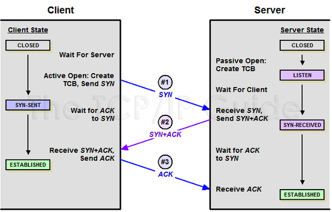
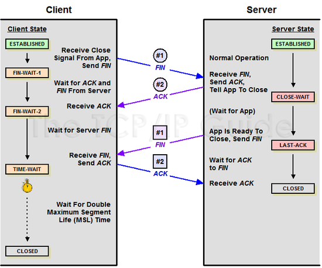

# 간단한 답변
TCP는 연결지향이며 순서를 보장합니다. 특히 3-way-handshake와 4-way-handshake를 이용해 신뢰성이 높은 대신 속도가 느린 특징이 있습니다. UDP는 비연결형 서비스이며 순서를 보장하지 않고 신뢰성이 낮은 대신 속도가 빠릅니다.

  

# 3-way-handshake의 과정
3-way-handshake는 장치간 신뢰성있는 연결을 할 때 사용되는 것입니다. 

과정은 먼저 클라이언트에서 isn을 담아 syn을 서버로 보냅니다.

이를 수신한 서버는 서버 isn과 클라이언트 isn에 더하기 1을 한 승인번호를 syn과 ack에 담아 클라이언트로 보냅니다.

그리고 이를 받은 클라이언트는 ack에 서버 isn에 더하기 1을 한 승인번호를 ack에 담아 서버로 보냅니다. 

이 과정을 따라 3-way-handshake가 이루어집니다.

# 4-way-handshake의 과정

4-way-handshake는 장치간 연결을 해제할 때 사용됩니다.

그 과정은 먼저 클라이언트에서 FIN_WAIT1 상태로 전환한 뒤 서버로 FIN을 보냅니다.

그러면 서버는 CLOSE_WAIT 상태로 전환한 뒤 클라이언트로 ACK를 보냅니다. 일정시간이 지난뒤 FIN을 클라이언트로 보냅니다.

이를 수신한 클라이언트는 TIME_WAIT로 상태를 바꾼뒤 서버로 ACK를 보냅니다. 그리고 일정시간이 지난뒤 CLOSED 상태로 전환합니다.

ACK를 수신한 서버 또한 CLOSED 상태로 전환합니다.

이 과정을 따라 4-way-handshake가 이루어집니다.

 
 

## 배경 지식

- 3-handShake의 과정
 

- 4-way-handShake의 과정
 

- TIME_WAIT
- 만약, FIN flag 전송 전에 패킷이 라우팅 지연, 패킷 유실로 인한 재전송 등으로 인해 FIN 패킷보다 늦게 도착하는 상황일 경우, 이 패킷을 DROP 되고 데이터 유실이 발생합니다. 이에 대비해서, A는 B로부터 FIN을 수신하더라도 일정 시간(디폴트 240초) 동안 세션을 남겨놓고 잉여 패킷을 기다리는 과정을 의미합니다.